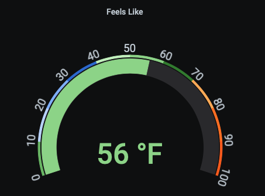

# ambientweather-exporter

Simple Python/Flask exporter for [AmbientWeather](https://ambientweather.net) for [Prometheus](https://prometheus.io/) and [InfluxDB](https://www.influxdata.com/).
You can use it to pull and push metrics from your PWS.
You will need to set up [AmbientWeather](https://ambientweather.docs.apiary.io/#introduction/authentication) application and API keys.


## Metrics (Prometheus)

```bash
❯ curl -s localhost:10102 | head -1
ambientweather_dateutc{macAddress="...",name="...",lat="...",lon="...",address="...",location="...",tz="..."} 1645376160000
ambientweather_tempinf{macAddress="...",name="...",lat="...",lon="...",address="...",location="...",tz="..."} 66.9
ambientweather_humidityin{macAddress="...",name="...",lat="...",lon="...",address="...",location="...",tz="..."} 37
```

## Metrics (Influx)

```bash
❯ curl -s localhost:10102/influx | head -3
ambientweather_dateutc,macAddress="...",name="...",lat="...",lon="...",address="...",location="...",tz="..." value=1645376820000 1645376888607487600
ambientweather_tempinf,macAddress="...",name="...",lat="...",lon="...",address="...",location="...",tz="..." value=66.7 1645376888607507600
ambientweather_humidityin,macAddress="...",name="...",lat="...",lon="...",address="...",location="...",tz="..." value=37 1645376888607516200
```

## Help

```bash
❯ python3 ./ambientweather-exporter.py --help
usage: ambientweather-exporter.py [-h] [--listen-on LISTEN_ON]
                                  [--listen-port LISTEN_PORT]
                                  [--ambi-app-key AMBI_APP_KEY]
                                  [--ambi-api-key AMBI_API_KEY]
                                  [--influx-enable]
                                  [--influx-host INFLUX_HOST]
                                  [--influx-port INFLUX_PORT]
                                  [--influx-db INFLUX_DB]
                                  [--influx-interval INFLUX_INTERVAL]

optional arguments:
  -h, --help            show this help message and exit
  --listen-on LISTEN_ON
                        IP address to listen on (default $LISTEN_ON if set,
                        else, '0.0.0.0')
  --listen-port LISTEN_PORT
                        Port to listen on (default 10102)
  --ambi-app-key AMBI_APP_KEY
                        AmbientWeather application key
  --ambi-api-key AMBI_API_KEY
                        AmbientWeather API key
  --influx-enable       Enable InfluxDB exporting (default False)
  --influx-host INFLUX_HOST
                        InfluxDB host (default 'influxdb')
  --influx-port INFLUX_PORT
                        InfluxDB port (default 8086)
  --influx-db INFLUX_DB
                        InfluxDB database (default 'ambientweather')
  --influx-interval INFLUX_INTERVAL
                        InfluxDB sending interval (default 300s)
```

## Python

```bash
❯ pip3 install -r requirements.txt
...

❯ AMBI_APP_KEY=hunter2 AMBI_API_KEY=hunter2 python3 ./ambientweather-exporter.py
INFO:ambientweather-exporter:Starting server
 * Serving Flask app "ambientweather-exporter" (lazy loading)
 * Environment: production
   WARNING: This is a development server. Do not use it in a production deployment.
   Use a production WSGI server instead.
 * Debug mode: on
INFO:werkzeug: * Running on http://0.0.0.0:10102/ (Press CTRL+C to quit)
INFO:werkzeug: * Restarting with stat
INFO:ambientweather-exporter:Starting server
WARNING:werkzeug: * Debugger is active!
INFO:werkzeug: * Debugger PIN: 999-984-877
```

## Docker

```bash
❯ docker run -it -p 10102:10102/tcp \
    -e AMBI_APP_KEY=$AMBI_APP_KEY \
    -e AMBI_API_KEY=$AMBI_API_KEY \
    mamercad/ambientweather-exporter:latest
...
```

## Helm

[Helm](https://helm.sh) must be installed to use the charts.
Please refer to Helm's [documentation](https://helm.sh/docs) to get started.

Once Helm has been set up correctly, add the repo as follows:

```bash
$ helm repo add ambientweather-exporter https://mamercad.github.io/ambientweather-exporter/
"ambientweather-exporter" has been added to your repositories
```

Update Helm repositories:

```bash
$ helm repo update | grep ambi
...Successfully got an update from the "ambientweather-exporter" chart repository
```

Find the exporter:

```bash
$ helm search repo ambientweather-exporter
NAME                                            CHART VERSION   APP VERSION     DESCRIPTION
ambientweather-exporter/ambientweather-exporter 0.2.0           0.2.0           A Helm chart for the AmbientWeather Exporter
```

Install the exporter:

```bash
$ helm install my-ambientweather-exporter \
  --namespace ambientweather --create-namespace \
  --set secret.ambi_app_key="$AMBI_APP_KEY" \
  --set secret.ambi_api_key="$AMBI_API_KEY" \
  --set service.type="LoadBalancer" \
  ambientweather-exporter/ambientweather-exporter
NAME: my-ambientweather-exporter
LAST DEPLOYED: Sat Feb 19 11:12:16 2022
NAMESPACE: ambientweather
STATUS: deployed
REVISION: 1
TEST SUITE: None
```

## Grafana



Panel JSON:

```json
{
  "fieldConfig": {
    "defaults": {
      "custom": {},
      "unit": "fahrenheit",
      "min": 0,
      "max": 100,
      "thresholds": {
        "mode": "absolute",
        "steps": [
          {
            "color": "green",
            "value": null
          },
          {
            "color": "super-light-blue",
            "value": 10
          },
          {
            "color": "light-blue",
            "value": 20
          },
          {
            "color": "semi-dark-blue",
            "value": 30
          },
          {
            "color": "super-light-green",
            "value": 40
          },
          {
            "color": "light-green",
            "value": 50
          },
          {
            "color": "dark-green",
            "value": 60
          },
          {
            "color": "light-orange",
            "value": 70
          },
          {
            "color": "semi-dark-orange",
            "value": 80
          },
          {
            "color": "dark-orange",
            "value": 90
          },
          {
            "color": "dark-red",
            "value": 100
          }
        ]
      },
      "mappings": []
    },
    "overrides": []
  },
  "gridPos": {
    "h": 9,
    "w": 6,
    "x": 0,
    "y": 0
  },
  "id": 2,
  "options": {
    "reduceOptions": {
      "values": false,
      "calcs": [
        "last"
      ],
      "fields": ""
    },
    "showThresholdLabels": true,
    "showThresholdMarkers": true
  },
  "pluginVersion": "7.1.5",
  "targets": [
    {
      "expr": "ambientweather_feelsLike",
      "interval": "",
      "legendFormat": " ",
      "refId": "A"
    }
  ],
  "timeFrom": null,
  "timeShift": null,
  "title": "Feels Like",
  "transparent": true,
  "type": "gauge",
  "datasource": null
}
```
